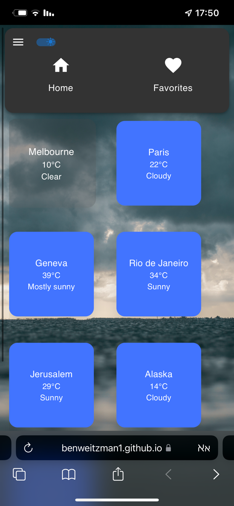

# Weather Wizard: Your Daily Forecast Companion

**Weather Wizard** is a seamless and intuitive weather application designed to provide accurate, up-to-date weather information for any city worldwide. Built with React and leveraging modern weather APIs, our application aims to provide users with a clear understanding of the current weather conditions, as well as a 4-day forecast.

🚀 **Live Application**: [Weather Wizard](https://benweitzman1.github.io/ben-weitzman-17-08-2023/)




## Table of Contents

- [Features](#features)
- [Getting Started](#getting-started)
- [Available Scripts](#available-scripts)
- [Dependencies](#dependencies)
- [Structure](#structure)
- [API Configuration](#api-configuration)
- [API Calls](#api-calls)

## Features

- Search for a city to view its current weather conditions.
- See a 4-day forecast for a city.
- Receive sports activity recommendations based on the weather.
- Add and remove cities from the favorites list.
- Toggle between light and dark mode for better visibility at any time of day.
- Switch between Celsius and Fahrenheit temperature scales.
- Enhanced Sidebar with Home and Favorites navigation.
- Redux state management for application data.
- Routes managed with React Router.
- Utilizes Material-UI (MUI) for a polished and responsive user interface.

## Getting Started

To get a local copy up and running, follow these steps:

1. Clone the repository to your local machine:
   ```bash
   git clone https://github.com/Benweitzman1/ben-weitzman-17-08-2023.git
   ```
2. Change into the project directory:
   ```
   cd ben-weitzman-17-08-2023
   ```
3. Install dependencies:
   ```
   npm install
   ```
4. Start the development server:
   ```
   npm start
   ```

Your app should now be running on http://localhost:3000.

## Dependencies

- React
- Redux and @reduxjs/toolkit
- Axios
- React Router
- Material-UI (MUI)

## Structure

Key components and modules:

- App: The main application wrapper.
- SideBar: An enhanced sidebar for easy navigation between main views.
- MainScreen: Displays the search bar, current weather conditions, and a 4-day forecast.
- FavoritesScreen: Displays a list of favorite cities and their current conditions.
- SportsActivities: Provides recommended sports activities based on the weather today.
- SearchBar: Lets users search for cities.
- FavoritesList: Renders the list of favorite cities.
- api: Contains API calls to retrieve weather data.

  Redux slices:

- favoritesSlice: Manages the state for favorite cities.
- weatherSlice: Manages the state for the weather data of the selected city.

## API Configuration

To make API calls, the application uses the following base URL and API key:

- **BASE_URL**: http://dataservice.accuweather.com
- **API_KEY**: C6JUnDwjWHtffQhjZ3Q8cqN6vUDFPKJv

## API Calls

The application makes use of three primary API calls to fetch data:

1. **Search City**

   - **Endpoint**: `/locations/v1/cities/autocomplete?apikey=${API_KEY}&q=${query}`
   - **Method**: `GET`
   - **Purpose**: This API call retrieves a list of cities based on the search query, providing city details such as localized name, country, administrative area, and a unique key for further weather data retrieval.

2. **Current Weather**

   - **Endpoint**: `/currentconditions/v1/${locationKey}?apikey=${API_KEY}`
   - **Method**: `GET`
   - **Purpose**: Utilizes the unique id of a city to fetch its current weather conditions. This includes the local observation time, a brief description of the current weather, the weather icon, temperature in both metric and imperial units, and associated links for more detailed weather information.

3. **4-day Forecast**
   - **Endpoint**: `/forecasts/v1/daily/5day/${locationKey}?apikey=${API_KEY}`
   - **Method**: `GET`
   - **Purpose**: Utilizes the unique id of a city to fetch its 5-day weather forecast. The forecast provides daily details like expected high and low temperatures, a general description of the day's weather conditions, and associated links for a detailed forecast.

4. **Current Conditions for Sports Activities**
   - **Endpoint**: `/indices/v1/daily/1day/${locationKey}/${sportId}?apikey=${API_KEY}`
   - **Method**: `GET`
   - **Purpose**: Fetches the recommended sports activities based on the weather for a city.
